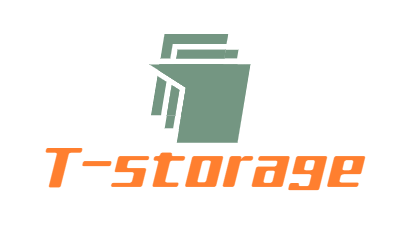

# T-storage

README **[English doc](./README.md)** | **[中文 doc](./README.zh.md)**

<p align="center">

</p>

# What is T-storage?
T-storage is a storage plugin based on modern browsers that encapsulates LocalStorage and SessionStorage.

It borrows the idea of a database and stores the data you need to store according to the three levels of DB_NAME => TABLE_NAME => FIELD_NAME. The time option is added to the data () storage process to limit the length of data storage. 


[](./LICENSE)
[](https://www.npmjs.com/package/t-storage)


## Features

- Store data of the same type together to avoid naming conflicts and variable pollution.
- There is a time limit on the data stored.


## Install

**Introduced through script tags**
```
https://cdn.jsdelivr.net/npm/t-storage/dist/tstorage.min.js
```

```javascript
var storage = window.Tstorage;
```

**Introduced through npm**
```
npm install t-storage -S
```

```javascript
import storage from 't-storage'
```

## Usage

```javascript
// localStorage
storage.data();


// sessionStorage
storage.session.data()
```

```javascript
// // Most used LocalStorage
let dog1 = storage.data('dog', {
  key: 'dog1',
  value: 'Tom'
})
console.log(dog1);
console.log(storage.data('dog'));
console.log('🐶')

let dog2 = storage.data('dog', {
  key: 'dog2',
  value: {
    name: 'Charlie',
    age: 'tow'
  }
})
console.log(dog2);
console.log(storage.data('dog'));
console.log('🐶')

// // Time-Limited Storage: Time in Seconds
// // Don't milliseconds
let cat1 = storage.data('cat', {
  key: 'cat1',
  value: {
    name: 'Cleo',
    age: 'one'
  },
  time: 5 * 60 * 60, // 5 hours
  // time: '2020/3/7 8' // Future time YES
  // time: '2020/3/7 8:59' // Future time YES
  // time: '22020/3/7 08:23:23:14:58' // Malformed
  // ...
})
console.log(cat1);
console.log(storage.data('cat'));
console.log('🐱');
```

- localStorage uses storage.data (), sessionStorages uses storage.session.data ()
- time parameter you can pass the number of seconds, representing the length of time you want to store, for example you want to store 1 hour, time should pass 1 * 60 * 60
- You can also pass a date format to the time parameter, which means that this storage will be deleted on a certain date in the future. For the date format, see **[demo](demo/index.html)** 
- More usage **[demo](demo/index.html)** 


## API List

|api|explain|
|----|-----|
|.data()|**Set and get the specified value**|
|.has()|**Determine if there is a specified value**|
|.clear()|**Clear all values in storage space**|
|.getAll()|**Get all values in space**|
|.forEach()|**forEach each data in the storage space and call the callback function**|

## License
[MIT](http://opensource.org/licenses/MIT)

T-storage is [MIT licensed](./LICENSE).
